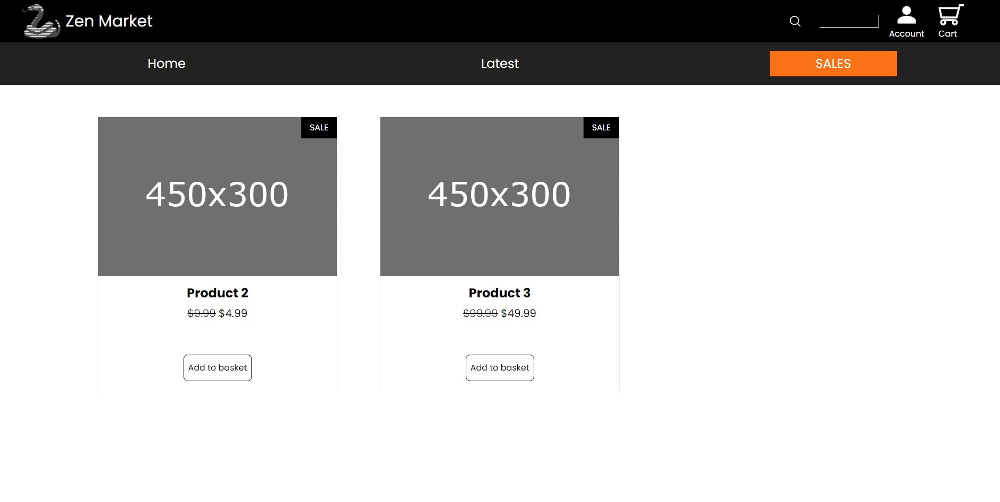

<h1>Zen Market Mockup Shop</h1>

This is a mockup e-commerce website project called Zen Market, aimed at showcasing a minimalistic and serene design while providing essential shopping features. The project includes React.js with TypeScript for the front-end, and Django and Django REST framework for the backend.

<h2>Features</h2>
<ul>
  <li>Homepage with a featured product section, categories section, and footer with contact information and social media links.</li>
  <li>Product catalog page that displays a grid of products, with filtering and sorting options.</li>
  <li>Product detail page that provides information about the product, its images, and reviews.</li>
  <li>Shopping cart page that shows the items in the cart, with the option to remove them.</li>
  <li>Checkout page that collects shipping and billing information, and allows customers to review their order before placing it.</li>
</ul>
<h2>Technologies Used</h2>

The front-end of the Zen Market mockup shop was built using React.js with TypeScript for type safety and better scalability. The backend was built using Django and Django REST framework to handle server-side operations.

<h2>Screenshots</h2>

Take a look at some of the pages of Zen Market mockup shop:

<h2>Getting Started</h2>

To run the Zen Market mockup shop project:

<ol>
  <li>Download or clone the repository</li>
  <li>Install the necessary dependencies using the package manager of your choice</li>
  <li>Navigate to the project's backend directory</li>
  <li>Run the command <code>python manage.py runserver</code> to start the server</li>
  <li>Open a web browser and navigate to the URL <code>localhost:8000</code> to view the website</li>
</ol>

If you would like to populate the website with sample data, you can do so by running the command <code>python manage.py loaddata fixtures.json</code> in the backend directory of the project. This will load a set of sample products and reviews into the database.

<h3>Contributing</h3>

Contributions to the Zen Market mockup shop project are welcome! Feel free to open an issue or submit a pull request if you have any suggestions or improvements.

<h3>License</h3>

The Zen Market mockup shop project is licensed under the MIT License. See the LICENSE file for more details.

<i>I hope you enjoyed exploring the Zen Market mockup shop project and find it useful for learning web development or testing e-commerce features. Please let me know if you have any feedback or questions.</i>

